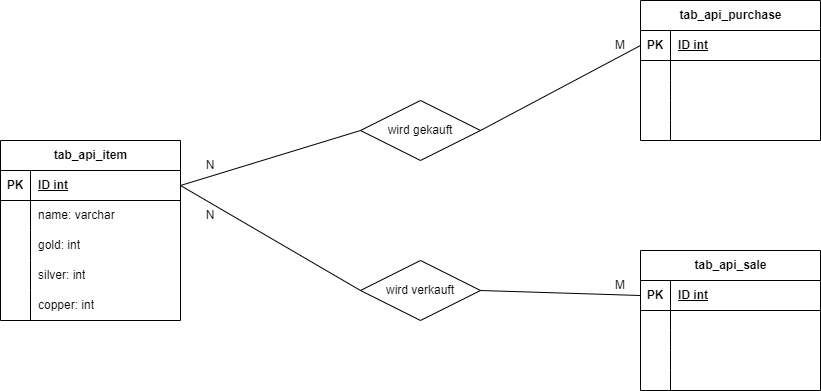

# Projektdokumentation

## Einleitung
### Installation und Einrichtung
Die Installation und Einrichtung des Projektes erfordert einige kleinere Schritte. Grundsätzlich ist eine Installation 
von Python erforderlich, in diesem Projekt wird Python in der Version 3.10 genutzt (https://www.python.org/downloads/).  

Für die REST-Schnittstelle ist die Installation von diversen Paketen erforderlich, unter anderem FastAPI, 
SQLAlchemy und Pydantic. Die Pakete müssen über die Paketverwaltung pip vor der Nutzung der Schnittstelle installiert werden. 
Mit einer vorhandenen Python Installation kann "pip install XXX" in die Konsole eingegeben werden. Jedoch gibt es dazu zwei
Einschränkungen. Die Konsole muss sich im Pfad des Projektes und des entsprechenden Backends befinden, in unserem Projekt 
also "wow-sales-project/backend". Außerdem ist das "XXX" zu ersetzen durch das zu installierende Paket. Eine Liste der Pakete,
die zu installieren sind, sowie ihr grober Einsatzbereich folgt:

- Pydanctic, das Paket wird zur Schematisierung der verschiedenen Objektarten genutzt, um sie in der Response als JSON Value einzubinden.
- FastAPI, dieses Paket wird benötigt, um die RestAPI aufzubauen und bietet Möglichkeiten zur Validierung, Serialisierung und Deserialisierung von Daten
- Uvicorn, ist eine ASGI WebServer Implementation für Python und wird benötigt, um einen WebServer aufzubauen und zu starten.
- SQLAlchemy, ist ein Paket zur Kommunikation mit der Datenbank und wird im Rahmen des Projektes auch im Rahmen des ORM genutzt.
- Typing, ist ein Paket für die Standard-Notation für Funktions- und Variablen-Typ-Annotationen.

## API-Spezifikation
### Beschreibung der verfügbaren Endpunkte
Mithilfe des Frameworks FastAPI von openai können verschiedene Endpunkte für die Schnittstelle aufgebaut werden. Über diese 
Endpunkte treffen die Http-Requests auf die Schnittstelle und können mit den entsprechenden Daten verarbeitet werden. 
So lassen sich für verschiedene Anwendungsfälle verschiedene Endpunkte implementieren und die Services können die ihnen zugewiesene
Businesslogik durchführen. Außerdem lassen sich so Daten über simple Http-Get-Requests erfragen, aber auch über Post- oder Put-Request persistent in 
der Datenbank speichern. Auch Auswertungen über beispielsweise den höchsten Preis in der Historie oder andere lassen sich darüber zurückgeben. 
Eine Liste der verfügbaren Endpunkte sowie deren Parameter und die entsprechenden Responses sind in der openai Swagger UI zu finden oder 
im Anhang. Die Swagger UI lässt sich bei laufendem WebServer unter "localhost:8000/docs" erreichen.

## Implementierungsdetails
### Architektur des Projekts
### Verwendung von Datenbanken oder anderen Backend-Services
Für das Projekt wird eine SQLite Datenbank verwendet. Die Entscheidung für die SQLite Datenbank wurde aufgrund von mehreren Faktoren getroffen. 
Unter anderem spielt der Umfang des Projektes eine große Rolle, sowie die Nutzung des Projektes. Weitere Kriterien waren die 
Zugänglichkeit der Datenbank und die Erreichbarkeit von verschiedenen Instanzen der Anwendung. 
Eine dauerhafte Erreichbarkeit ist für die Nutzer sehr wichtig, sodass eine mögliche Lösung für die Datenbank eine selbstgehostete Datenbank Instanz
im eigenen Zuhause voraussetzen würde, beispielsweise in einem Docker-Container auf einem Raspberry PI. Diese Möglichkeit bietet allerdings 
keine garantierte Ausfallsicherheit, sodass die Alternative auf eine fremdgehostete Instanz auf beispielsweise einer AWS-Node fallen würde.
Dies wäre allerdings mit erheblichen Kosten und Einrichtungsaufwand verbunden, sodass eine lokal eingebundene Datenbank, wie bei SQLite, 
alle gewünschten Anforderungen erfüllt und keine zusätzlichen Kosten verursacht. Gleichzeitig ist die Ersteinrichtung sehr trivial. 
Die Zugänglichkeit ist durch die Variante von SQLite ebenfalls abgedeckt. Durch die Lokalisierung im Projekt selbst, sind keine Zugangsdaten notwendig. 
Die Datenbank ist eben nur zugänglich, sobald man das Projekt geklont und geöffnet hat, da diese Punkte aber durch die Rechteverwaltung in 
GitHub abgedeckt sind, sind zusätzliche Nutzerdaten für den Zugang zur Datenbank zu vernachlässigen und der Punkt der Zugänglichkeit jederzeit gegeben.
### Aufbau des Datenbankschemas
Das Datenbankschema wurde auf Basis der Projektidee entworfen und in Zusammenarbeit konzipiert. Eine grafische Darstellung des Schemas befindet sich am Ende 
des Kapitels. 
Zunächst wurde sich vor Augen geführt welche Daten in der Datenbank gespeichert werden sollen und welche Konventionen für die Datenbank gelten sollen. 
Unter anderem sind hier Naming Konventionen gemeint, also wie die Tabellen heißen sollen und wie die Struktur dieser Namen aussehen soll. 
Für die Konventionen haben wir uns für die Koventionen entschieden, die im Betrieb gelten. Diese geben eine klare Struktur vor und eindeutig lesbar.
Anhand des Beispiels der Tabelle für die Items werden diese kurz erläutert:

"tab_api_item" beinhaltet 3 Informationen die für die entwickelnden Personen von Bedeutung sind. "tab" gibt an, dass es sich um eine Tabelle handelt, "api" um 
welchen Namespace es sich handelt und "item" gibt den konkreten Tabelleninhalt an. 

Im Gespräch um die Datenbank und welche Daten gespeichert werden sollen, wurde recht schnell klar, dass es drei primäre Entitäten gibt, welche eine
persistente Speicherung benötigen. Das Item, der Verkauf (Sale) und der Kauf (Purchase). Für diese drei sind also eigene Tabellen notwendig und bekommen eigene 
Attribute, jeweils eine ID zur eindeutigen Identifikation. Das Item zusätzlich einen Namen und einen Preis in Form von Gold, Silber und Kupfer.

### Behandlung von Fehlern und Ausnahmen im Backend
Fehler und Ausnahmefälle sind im Projekt vorallem durch die Requests und Responses abgedeckt. Wird zum Beispiel bei Abruf eines Items dieses nicht gefunden, 
so wird eine HTTPException mit entsprechendem Fehlercode an das Frontend zurückgegeben. 

Weiterhin findet im Item-Service eine Validierung des Preises eines Items statt.
So wird geprüft, ob die Fachlichkeit (1 Gold = 100 Silber, 1 Silber = 100 Kupfer) richtig persistiert wird und ein Item nicht mit einem Preis von 1 Gold 142 Silber und 222 Kupfer
gespeichert wird.
## Anhang
### Glossar der verwendeten Begriffe
- ASGI
- Docker
- Container

### Links zu weiteren Ressourcen und Dokumentation
- localhost:8000/docs (openAPI Swagger UI)